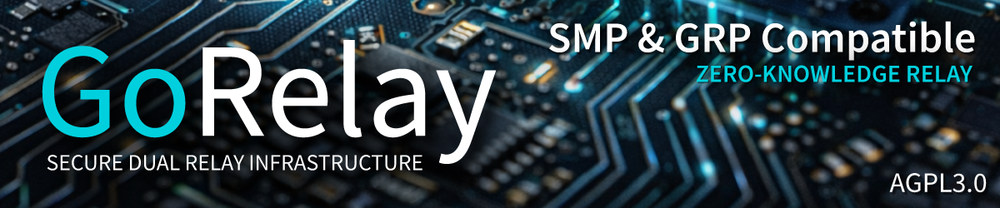

<p align="center">
  
</p>

<h1 align="center">GoRelay</h1>

<p align="center">
  <strong>Secure Dual Relay Infrastructure for Messaging, IoT, and High-Security Applications.</strong><br>
  Zero-knowledge by construction. Post-quantum by design.
</p>

<p align="center">
  <a href="LICENSE"></a>
  <a href="#quick-start"></a>
  <a href="#status"></a>
  <a href="https://wiki.gorelay.dev"></a>
</p>

---

GoRelay is a dual-protocol encrypted relay server written in Go. It provides anonymous, metadata-resistant communication infrastructure for messaging, IoT sensor networks, and high-security applications.

The project was born from a simple observation: existing messaging protocols treat every conversation the same way, whether it is a group chat between friends or a command to a medical device. Group functionality forces architectural compromises - shared keys, fan-out delivery, metadata leakage about group membership. By deliberately excluding group messaging from the protocol layer, GoRelay guarantees that every single message receives its own full Double Ratchet encryption with perfect forward secrecy. No exceptions, no shortcuts, no shared state between conversations.

This makes GoRelay particularly suited for environments where each data channel must be independently secured: industrial control systems, medical telemetry, building security, fleet management, and any scenario where compromising one channel must never compromise another.

GoRelay compiles to a single binary with zero dependencies. Download, configure, run. One file, three ports, full encryption.

---

## Two Protocols, One Server

GoRelay runs two protocols simultaneously, sharing a single encrypted queue store.

**SMP (Port 5223)** implements the SimpleX Messaging Protocol v7. Any SMP-compatible client can connect and exchange messages through GoRelay. This provides immediate access to a proven, audited messaging protocol and its existing user base. SMP compatibility was verified against the SimpleX Chat desktop application on March 22, 2026.

**GRP (Port 7443)** is the GoRelay Protocol - designed specifically for microcontroller hardware, IoT infrastructure, and high-security environments. GRP uses the Noise Protocol Framework for transport, mandatory post-quantum key exchange with ML-KEM-768 hybridized with X25519, and two-hop relay routing where no single server knows both sender and recipient.

The critical difference: SMP was designed for smartphone apps. GRP is designed for dedicated hardware that runs without an operating system, for sensors that transmit data autonomously, and for environments where "optional security" is not acceptable. Every GRP feature is mandatory. There are no flags to disable encryption, no fallback to plaintext, no negotiation downward.

Both protocols deliver to the same queue store. A hardware device sending via GRP and a phone user reading via SMP see the same message. Full interoperability between worlds.

---

## Why No Groups?

This is a deliberate architectural decision, not a limitation.

Group messaging protocols share a fundamental problem: a single message must reach multiple recipients. This requires either shared symmetric keys where one compromised member exposes the entire group, or complex fan-out trees where metadata about group size and membership leaks to the server. Every messaging protocol that supports groups makes trade-offs in forward secrecy, post-compromise security, or metadata resistance to accommodate this.

GoRelay takes a fundamentally different path. Every message is a point-to-point transmission with its own unique encryption keys derived from an independent Double Ratchet session. There is no concept of a group at the protocol level. The server sees only individual queue operations and cannot determine whether multiple queues serve the same conversation or entirely separate purposes.

This means compromising one communication channel reveals exactly zero information about any other channel. There is no group key to steal, no membership list to extract, no fan-out pattern to analyze. Each channel is cryptographically independent from every other channel on the server.

For IoT and industrial applications, this is not just a nice property - it is essential. A temperature sensor reporting to a monitoring station and an access control system receiving unlock commands must be completely isolated from each other, even if they share the same relay server. GoRelay guarantees this isolation at the protocol level, not through configuration.

For regular chat conversations, group-like behavior is handled entirely on the client side. A client that wants to send a message to ten people sends ten individual encrypted messages through ten independent channels. The server has no knowledge that these messages are related. This is how SMP-compatible clients already handle groups - the server never knows groups exist.

The result: GoRelay servers are simpler, more secure, and have a smaller attack surface than servers that implement group logic. The complexity lives where it belongs - in the client applications that understand the social context.

---

## Security

GoRelay is a zero-knowledge relay. The server stores and forwards encrypted blobs without the ability to read, modify, or correlate message content. This is not a policy choice - it is a structural property of the code. There is no administrator backdoor, no debug mode that reveals plaintext, no logging facility that captures content, because the code to do these things does not exist.

**No IP logging** - structurally absent from the codebase, not disabled by configuration.

**Per-message encryption** - every message stored in BadgerDB is encrypted with its own random AES-256-GCM key. Compromising the database file reveals nothing without the individual message keys.

**Cryptographic deletion** - when a message is acknowledged, its encryption key is zeroed before the database entry is removed. Even forensic recovery of deleted data produces only ciphertext with a destroyed key.

**Constant-time authentication** - all signature verification runs in constant time regardless of whether a queue exists. Timing attacks cannot reveal the existence of queue IDs.

**Fixed 16 KB blocks** - every transmission is padded to exactly 16,384 bytes. Traffic analysis cannot determine message size, command type, or whether a block contains data or padding.

**Redelivery loop protection** - messages that repeatedly fail delivery are automatically discarded after 5 attempts. This prevents an attacker from crafting a malicious message that crashes the recipient on every delivery attempt, which would otherwise brick the device for the entire TTL period.

**48-hour default TTL** with a hard maximum of 7 days. Messages do not accumulate indefinitely. Garbage collection runs every 5 minutes.

---

## Use Cases

**Private Messaging** - Run your own relay server for personal or organizational communication. No accounts, no phone numbers, no metadata. Compatible with existing SMP clients out of the box.

**Medical and Health Monitoring** - Transmit patient data and sensor readings through independently encrypted channels. Each device-to-server connection has its own keys. Compliance with data protection regulations is built into the architecture, not bolted on afterward.

**Industrial Sensor Networks** - Collect data from environmental sensors, production equipment, and infrastructure monitoring through encrypted channels that cannot be manipulated or eavesdropped. Relevant for water treatment, energy infrastructure, manufacturing, and SCADA environments where data integrity is a safety requirement.

**Building Security and Access Control** - Door locks, alarm systems, and surveillance through encrypted point-to-point channels. Commands cannot be intercepted, replayed, or spoofed. Each device operates on an isolated channel.

**Fleet and Asset Tracking** - Monitor location, temperature, and status of sensitive shipments. Prevent third parties from building movement profiles or correlating logistics data.

**Emergency and Field Communication** - Deploy relay infrastructure rapidly for disaster response, field operations, or environments where centralized services are unavailable or untrustworthy.

---

## Quick Start

**Build from source:**
```bash
git clone https://github.com/saschadaemgen/GoRelay.git
cd GoRelay
go build -o gorelay ./cmd/gorelay
```

**Run:**
```bash
./gorelay
```

GoRelay generates an Ed25519 CA certificate on first run and prints the SMP URI:

```
smp://<fingerprint>@<host>:5223
```

Add this URI in any SMP-compatible client to use your server.

**Custom configuration:**
```bash
./gorelay --smp-port 5224 --host relay.example.com --data-dir /var/lib/gorelay
```

All settings are also available as environment variables: `GORELAY_SMP_PORT`, `GORELAY_GRP_PORT`, `GORELAY_HOST`, `GORELAY_DATA_DIR`, `GORELAY_ADMIN_PORT`. CLI flags take precedence over environment variables.

**Cross-compile for Linux from Windows:**
```powershell
$env:GOOS = "linux"
$env:GOARCH = "amd64"
go build -o gorelay ./cmd/gorelay
```

**Admin dashboard** runs on localhost:9090. Access via SSH tunnel:
```bash
ssh -L 9090:127.0.0.1:9090 user@your-server
```

---

## Test Client

GoRelay includes a CLI tool for server verification:
```bash
go build -o gorelay-test ./cmd/gorelay-test

# Ping test with latency measurement
./gorelay-test ping --server host:port

# Full message cycle: NEW -> KEY -> SEND -> MSG -> ACK
./gorelay-test full-test --server host:port
```

---

## Architecture

```
cmd/gorelay/                    Server entry point, CLI flags
cmd/gorelay-test/               SMP test client
internal/config/                Configuration (koanf)
internal/server/                Server, Client, SubscriptionHub, Admin Dashboard
internal/protocol/common/       Block framing, transmission format
internal/protocol/smp/          SMP handshake, command encoding
internal/protocol/grp/          GRP protocol (Phase 4)
internal/queue/                 QueueStore interface + BadgerDB implementation
internal/relay/                 Relay-to-relay forwarding (Phase 5)
```

Each connection spawns three goroutines communicating via channels:

```
Client --TLS--> [Receiver] --chan--> [Processor] --chan--> [Sender] --TLS--> Client
                                         |
                                   [QueueStore]
                                [SubscriptionHub]
```

---

## Part of the SimpleGo Ecosystem

GoRelay is the server component of a larger ecosystem built around dedicated hardware for encrypted communication and IoT.

[**SimpleGo**](https://github.com/saschadaemgen/SimpleGo) is the world's first native C implementation of the SimpleX Messaging Protocol, running on ESP32-S3 microcontrollers. It is a complete autonomous firmware - not an app on a smartphone OS. No Android, no iOS, no baseband processor. Four FreeRTOS tasks across two CPU cores handle networking, encryption, storage, and display independently.

SimpleGo implements five encryption layers per message including post-quantum key exchange with sntrup761, AES-256-GCM encrypted SD card storage, and has been verified with 7 simultaneous contacts against the official SimpleX Chat application. The codebase spans 47 C source files and 21,863 lines.

Together, the two projects form a complete stack:

```
SimpleGo (ESP32-S3) --SMP--> GoRelay <--SMP-- Any SMP Client
Dedicated hardware            [QueueStore]     Phone, Desktop, etc.
5 encryption layers           [BadgerDB + AES-GCM]
sntrup761 post-quantum

SimpleGo (ESP32-S3) --GRP--> GoRelay <--GRP-- Other GRP devices
ML-KEM-768 (planned)          [Noise + Post-Quantum]  IoT sensors, controllers
```

The microcontroller environment is the reason GoRelay exists. Smartphones come with their own messaging apps. Microcontrollers do not. They need infrastructure that understands their constraints - limited memory, intermittent connectivity, no user interface for key management - while providing the same security guarantees as any desktop application. GoRelay is that infrastructure.

---

## Roadmap

- [x] Phase 0 - Research, protocol analysis, 40 documentation files
- [x] Phase 1 - SMP v7 skeleton (all core queue operations)
- [ ] Phase 2 - Extended queue operations, connection management
- [ ] Phase 3 - Production readiness (Docker, systemd, Prometheus, rate limiting)
- [ ] Phase 4 - GRP protocol (Noise IK/XX, ML-KEM-768 post-quantum, X25519 hybrid)
- [ ] Phase 5 - Two-hop relay routing, cover traffic, queue rotation

---

## Status

Alpha software under active development. The SMP protocol core is functional and verified against the SimpleX Chat desktop application. GRP development begins after production hardening.

---

## Contributing

GoRelay is open source under AGPL-3.0. All code, comments, commits, and documentation in English. Conventional Commits format. Feature branches with squash-merge to main. `go test -race ./...` must pass.

Security vulnerabilities should be reported privately via GitHub Security Advisories.

---

## License

AGPL-3.0 - See [LICENSE](LICENSE) for details.

---

## Acknowledgments

GoRelay builds on the open SimpleX Messaging Protocol for interoperable message delivery. The SMP specification and the work of the SimpleX community made this project possible.

[BadgerDB](https://github.com/dgraph-io/badger) (embedded storage) - [flynn/noise](https://github.com/flynn/noise) (Noise Protocol Framework) - [Go](https://go.dev/) (language and runtime)

---

<p align="center">
  <i>GoRelay is an independent open-source project by IT and More Systems, Recklinghausen, Germany.</i><br>
  <i>It is not affiliated with or endorsed by any third party.</i>
</p>

<p align="center">
  <strong>GoRelay - Secure Dual Relay Infrastructure.</strong><br>
  <strong>Zero-knowledge by construction. Post-quantum by design.</strong>
</p>
